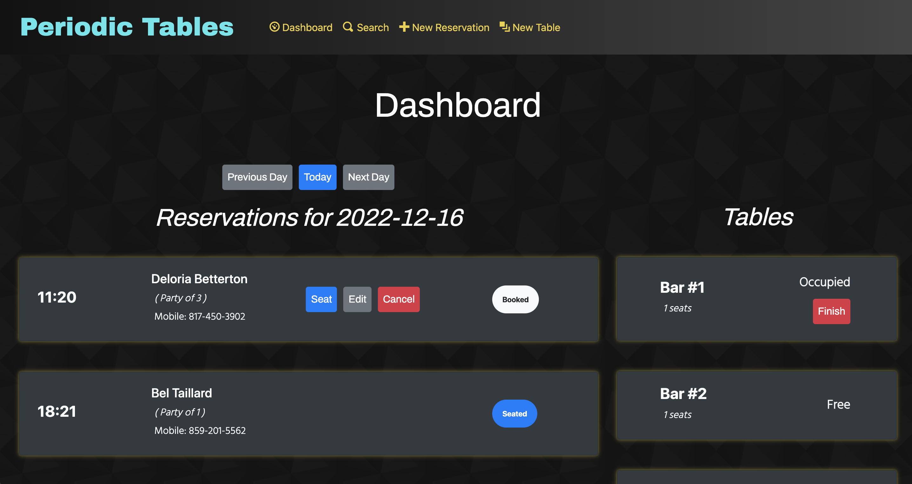

# Periodic Tables - Restaurant Reservation System

 

## [View Application](https://restaurant-reservation-client-27ki.onrender.com/)

 

## About Periodic Tables

Periodic Tables is a restaurant reservation system to manage reservations and seat guests at tables. 
This responsive app can be used across desktop, tablet, and mobile devices.

 

### Main features:

- Take reservations for current and future dates
  

  
- Edit or cancel existing reservations that have not been seated
  

  
- Create and seat tables
  

  
- Search for reservations by phone number
  

  
- Free tables when guests leave
  

  

### Other Features

- Loading spinner while data loads
  

  
- No alert when no reservations exist for that day
  

  
- Informative errors on forms to prevent user and database errors
  

  

## API Endpoints

Server URL: https://restaurant-reservation-backend-xynu.onrender.com

| Endpoint                    | Methods             | Description                                                                      |
| ----------------------------|---------------------|----------------------------------------------------------------------------------|
| `/reservations`             |     | List and create reservations                           |
| `/reservations/:reservation_id`             |     | Retrieve and edit reservations by ID
| `/reservations/:reservation_id/status`             |     | Update the status of a specific reservation (Booked / Seated / Cancelled / Finished)
| `/tables`             |     | List and create tables
| `/tables/:table_id/seat`             |     | Seat and unseat tables. Uses knex transaction to sync with Reservations table |

 

## Technology

### Frontend
- Html
- CSS (Bootstrap)
- Javascript (ES6)
- React

### Backend
- Node.js
- Express
- PostgreSQL
- Knex

### Version Control
- Git

 

## Installation

| Folder/file path | Description                                                      |
| ---------------- | ---------------------------------------------------------------- |
| `./back-end`     | The backend project, which runs on `localhost:5001` by default.  |
| `./front-end`    | The frontend project, which runs on `localhost:3000` by default. |

### Backend Existing files

The `./back-end` folder contains all the code for the backend project.

The table below describes the existing files in the `./back-end` folder:

 

## Installation

1. Fork and clone this repository.
1. Run `cp ./back-end/.env.sample ./back-end/.env`.
1. Update the `./back-end/.env` file with the connection URL's to your SQL database instance.
1. Run `cp ./front-end/.env.sample ./front-end/.env`.
1. You should not need to make changes to the `./front-end/.env` file unless you want to connect to a backend at a location other than `http://localhost:5001`.
1. Run `npm install` to install project dependencies.
1. Run `npm run start:dev` to start your server in development mode.

## Additional Information

This project was the capstone project for my software engineering certificate through Thinkful. It was a great full-stack exercise that allowed me to further solidify my skills as a developer and make several decisions regarding the project's organization and user experience. I was able to stretch myself to develop new skills including Knex Transactions, CSS animations, and troubleshooting databases.
